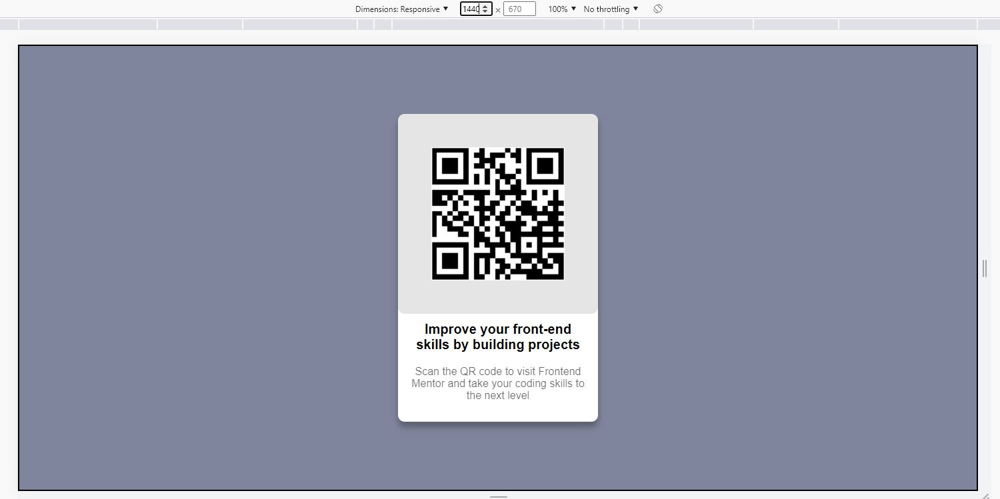
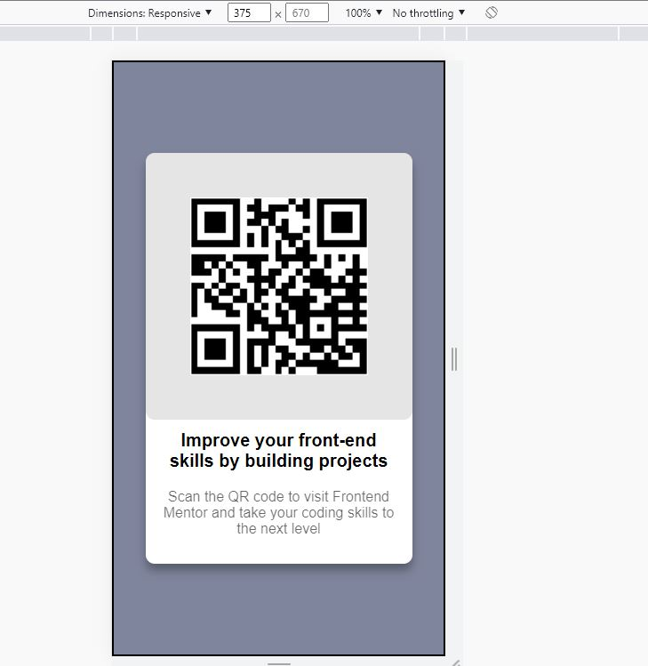

# Frontend Mentor - QR code component solution

This is a solution to the [QR code component challenge on Frontend Mentor](https://www.frontendmentor.io/challenges/qr-code-component-iux_sIO_H). Frontend Mentor challenges help you improve your coding skills by building realistic projects.

## Table of contents

- [Overview](#overview)
  - [Screenshot](#screenshot)
  - [Links](#links)
- [My process](#my-process)
  - [Built with](#built-with)
  - [What I learned](#what-i-learned)
  - [Continued development](#continued-development)
  - [Useful resources](#useful-resources)
- [Author](#author)
- [Acknowledgments](#acknowledgments)

**Note: Delete this note and update the table of contents based on what sections you keep.**

## Overview

Hello, My name is M.Wali(wali1209 => GitHUB username).
This my first FrontEndMentor project and this is also the first time I completed project using REACT + TypeScript.
I didn't use that  instead I use [QR-Code-API](https://goqr.me/api/) to generate QR Code with given text.
Project Dependencies:
REACT
TypeScript
styled-components

### Screenshot

### Links

- Solution URL: [Add solution URL here](https://your-solution-url.com)
- Live Site URL: [Add live site URL here](https://your-live-site-url.com)

### Built with

- HTML
- CSS
- [React](https://reactjs.org/) - JS library
- [Styled Components](https://styled-components.com/) - For styles
- [TypeScript](www.typescriptlang.org) - For Dynamic Web Page and type safety

### What I learned

Tried to code with React and TypeScript for the first time and learn lot of new thing but project was very small, So looking forward to for the bigger projects.
I also learn how to use style-components and how to install it with **npm**
And that's it!

-

## Author

- Frontend Mentor - [@Wali1209](https://www.frontendmentor.io/profile/Wali1209)
- Facebook - [Wali Hashmi](https://www.facebook.com/mdwali.hashmi.1/)
- GitHUB - [@Wali1209](https://github.com/Wali1209)
